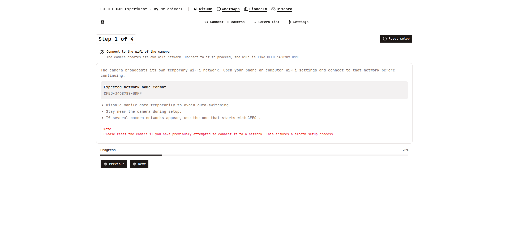
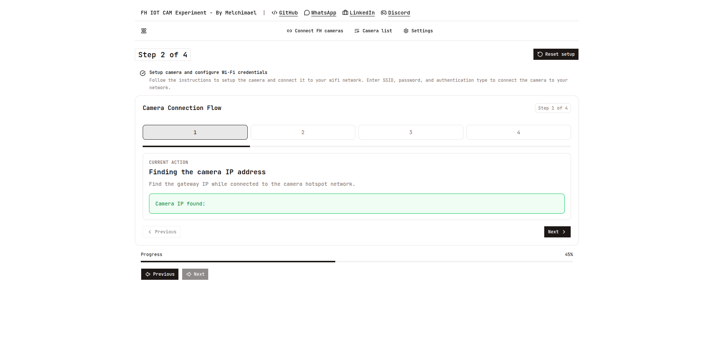
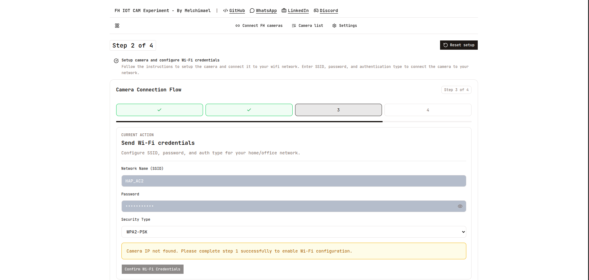

# FH8616 IoT Camera Platform

Project around cheap Fullhan (FH-xxxx) IP cameras. The setup pairs a lightweight edge server (e.g. Android via Termux) with a web client: discovering cameras on the local network, probing them for known vulnerabilities, then pushing Wi-Fi credentials to get the camera onto the target network.

Full process: connect to the camera's native Wi-Fi → bypass root/user access by exploiting a telnet vulnerability (for research/educational purposes only) → the camera joins the network's Wi-Fi → full access to its services (ONVIF, RTSP, FTP, etc.).

Internally, the camera runs a BusyBox system that handles everything (Wi-Fi connectivity, infrared, etc.); the `/app` folder holds all the scripts and binaries that make the camera work.


## Architecture

```
                             LAN
 ┌──────────┐        ┌─────────────────────────────┐        ┌────────────┐
 │ FH-xxxx  │  RTSP  │ Edge server (Node, Termux)   │  tRPC  │ Web client │
 │ IP cams  │<──────>│  ├─ tRPC API (Express)       │<──────>│ (React SPA │
 │          │  ONVIF │  ├─ network scan / vuln probe│        │  + SSR)    │
 │          │        │  └─ spawns go2rtc            │        └────────────┘
 │          │        └─────────────┬───────────────┘               │
 │          │                      │ RTSP → WebRTC / HLS / MSE      │
 │          │                      └───────────────────────────────┘
 │          │        ┌─────────────────────────────┐
 │          │<───────┤ exploit/ scripts (operator) │
 │          │ TCP    │  ├─ vuln.sh  — probe RCE     │
 │          │ 1300   │  │            1300/843, tel- │
 │          │ 843    │  │            net 23, change │
 │          │ 23     │  │            passwd         │
 │          │        │  └─ quickRoot.sh — chpasswd  │
 │          │        │       via RCE + telnet root  │
 └──────────┘        └─────────────────────────────┘
```

Not a workspace monorepo: each package under `packages/` is installed and run
on its own.

## Screenshots

Connect-camera wizard (client):

| Step 1 — join camera Wi-Fi | Step 2 — find camera IP | Step 3 — send Wi-Fi credentials |
| --- | --- | --- |
|  |  |  |

## Packages

### `client/` — web UI
- **React 19** + **React Router 7** framework mode (SSR enabled, builds to `dist/`)
- **Vite 8** dev server, proxies `/trpc` to the server
- **TailwindCSS 4** (`@tailwindcss/vite`) + **shadcn/ui** (`base-lyra` style, Phosphor icons) + **Base UI**
- **tRPC client** (`@trpc/client`, `@trpc/react-query`) over **TanStack Query 5**
- **Zustand 5** for local state (connect-camera wizard steps)
- TypeScript, Node 24, multi-stage **Dockerfile** (`node:20-alpine`)
- Consumes go2rtc streams directly on port `1984`

Routes: home + camera list. Components: camera list / all-cameras live view,
connect-camera wizard (4 steps), navbar.

### `server/` — edge API
- **Node 24** on **Termux** (Android used as the edge box)
- **Express 5** + **tRPC server 11**, input validation with **Zod 4**
- `dotenv`, `cors`; dev via `tsx watch`, build via `tsc` (TypeScript 6)
- Structure: `router.ts` → `resolvers/` (one procedure per file) + `tools/` (helpers)
- Resolvers: `getCameraList`, `getCameraIp`, `searchCameras`, `checkVulnByIp`,
  `setWifiCredentials`, `hello`
- Tools: local-network IP enumeration, go2rtc process control, global helpers
- Picks the matching go2rtc binary via `PROC_ARCHITECTURE` (`amd64` / `arm` / `arm64`)

### `goToRtc/` — RTSP restreamer
- **go2rtc** static binary per arch (`linux/amd64`, `linux/arm`, `linux/arm64`) —
  binary + live `go2rtc.yaml` are git-ignored, see `packages/goToRtc/README.md`
- `go2rtc.yaml` maps camera RTSP URLs to named streams (`go2rtc.yaml.example` shipped)
- Server spawns it; client plays the streams (WebRTC / HLS / MSE) on port `1984`

### `exploit/` — camera exploitation PoC
- `vuln.sh`, `quickRoot.sh` — shell scripts for telnet/user bypass and rooting
  the target cameras during testing

### `camera-scripts/` — on-device scripts
- `scripts/` — payloads meant to be copied to the camera SD card and run on the
  camera itself (init, maintenance, automation)

## Setup

```sh
# server
cd packages/server && cp .env.example .env && npm install && npm run dev

# client
cd packages/client && cp .env.example .env && npm install && npm run dev

# go2rtc (binary + config are git-ignored)
# see packages/goToRtc/README.md
```

`.env` keys — server: `PORT`, `PROC_ARCHITECTURE`; client: `VITE_PORT`,
`VITE_SERVER_URL`, `VITE_GO2RTC_PORT`.

---

MIT
